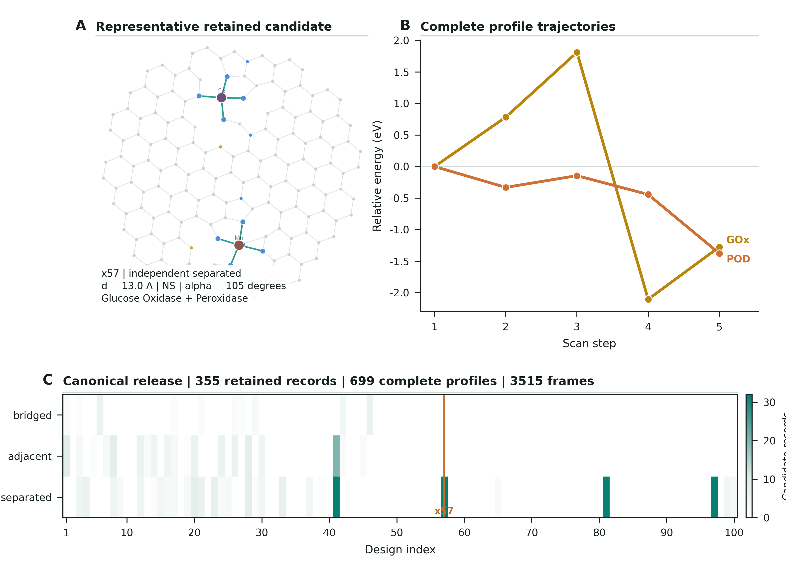

# E2N: Enzyme-to-Nanozyme Translation Workbench

E2N is an auditable computational workbench for translating selected
metalloenzyme evidence into explicit, topology-aware nanozyme design
hypotheses. It combines catalytic-motif representation, functional-residue
abstraction, material construction, physicochemical screening, optional
atomistic evaluation, a local Flask research interface, and a paper-facing
reproducibility layer.

> [!CAUTION]
> This is a public **pre-release computational repository**, not an
> experimentally validated catalyst report. It does not establish synthesis,
> catalytic activity, selectivity, biological efficacy, transition-state
> barriers, kinetic rate constants, onset potentials, pH optima, spectroscopy,
> microscopy, or universal topology superiority.

The public repository is intentionally small: the verified export contains
215 allowlisted payload files plus `BUILD_PROVENANCE.json` (216 files total),
with approximately 6.7 MiB of logical file content.
Large local PDB and motif libraries, raw calculations, model weights,
runtime databases, caches, journal workspaces, and private intermediate
records are described below but are **not uploaded**.

  

The image above belongs to the currently deposited verified figure generation
and is not a claim that the final V11 manuscript assets have been frozen.

## Table of contents

- [Why E2N exists](#why-e2n-exists)
- [Core scientific innovation](#core-scientific-innovation)
- [What the workflow does](#what-the-workflow-does)
- [Terminology that must not be collapsed](#terminology-that-must-not-be-collapsed)
- [Repository map](#repository-map)
- [Detailed code guide](#detailed-code-guide)
- [Installation](#installation)
- [Quick start](#quick-start)
- [Flask research workbench](#flask-research-workbench)
- [Public paper-facing data](#public-paper-facing-data)
- [Figures, reports, and reproduction](#figures-reports-and-reproduction)
- [Local data libraries not distributed on GitHub](#local-data-libraries-not-distributed-on-github)
- [Local output workspace not distributed on GitHub](#local-output-workspace-not-distributed-on-github)
- [Scientific and statistical interpretation](#scientific-and-statistical-interpretation)
- [Testing and continuous integration](#testing-and-continuous-integration)
- [Security, privacy, and third-party assets](#security-privacy-and-third-party-assets)
- [Citation, licensing, and release status](#citation-licensing-and-release-status)
- [Contributing](#contributing)

## Why E2N exists

Natural metalloenzymes achieve catalysis by arranging metal centers,
coordinating residues, second-shell functional groups, electrostatic
microenvironments, and substrate-facing geometry in a highly constrained
three-dimensional environment. Directly copying an entire protein into an
inorganic nanozyme is neither necessary nor generally practical. Conversely,
reducing an active site to only a metal identity discards much of the chemical
logic that makes the site meaningful.

E2N addresses the intermediate problem:

1. identify enzyme-derived structural and functional evidence;
2. retain the catalytic roles and spatial relationships that can be stated
   explicitly;
3. translate those constraints into a material-oriented design
   specification;
4. construct one or more topology-aware candidate structures;
5. evaluate constructibility, geometry, and finite-coordinate screening
   descriptors with explicit provenance; and
6. release a traceable evidence snapshot for audit, visualization, and future
   experimental testing.

The intended output is a **candidate hypothesis with an evidence trail**. It
is not a claim that an enzyme has literally been converted into a material,
and it is not a substitute for synthesis and assay data.

## Core scientific innovation

The central innovation is a residue-to-surface abstraction:

### 1. Functional amino-acid simplification

E2N does not attempt to preserve the entire amino-acid residue or protein
backbone. It simplifies selected catalytic residues into material-compatible
functional representations.

### 2. Functional-group retention

The simplification is constrained to retain the chemically relevant part of
the residue whenever supported by the source evidence. Examples include
nitrogen, oxygen, or sulfur donor groups; acid/base or nucleophilic roles;
metal coordination; hydrogen-bonding capacity; and second-shell
microenvironment functions.

### 3. Catalytic-role retention

The retained representation records why a group is present, not only its atom
type. A donor, general acid, general base, nucleophile, electrostatic
stabilizer, or substrate-positioning group must not be treated as an
interchangeable decoration.

### 4. Spatial-constraint retention

Distances, coordination numbers, geometry families, relative placement,
topology, and selected angular constraints are carried into an explicit
design specification. Requested constraints remain distinguishable from
relaxed or experimentally measured geometry.

### 5. Material instantiation

The abstracted functions are instantiated around single or multiple metal
centers on carbon-like support models, with optional heteroatom doping,
bridging, adjacent, or separated topologies and optional second-shell groups.

### 6. Evidence-aware evaluation

Each stage records its evidence class, method, convergence state, failure
state, and interpretation boundary. Geometry proxies, xTB-like
finite-coordinate descriptors, ML potentials, and prospective experiments
are never silently promoted to experimental proof.

## What the workflow does

~~~mermaid
flowchart LR
    A["EC number and enzyme evidence"] --> B["PDB or mmCIF structure library"]
    B --> C["Catalytic motif extraction"]
    C --> D["Functional-residue abstraction"]
    D --> E["DesignSpec"]
    E --> F["Metal cores, support, doping, second shell"]
    F --> G{"Topology"}
    G --> G1["Bridged"]
    G --> G2["Independent adjacent"]
    G --> G3["Independent separated"]
    G1 --> H["Assembly and constraint validation"]
    G2 --> H
    G3 --> H
    H --> I["Optional potential evaluation"]
    I --> J["Activity-specific finite-coordinate screening"]
    J --> K["Candidate and profile records"]
    K --> L["Curated publication snapshot"]
    L --> M["Figures, tables, report, verifier"]
    K --> N["Local Flask workbench"]
~~~

The public clone supports package inspection, local UI execution, release
integrity checks, report regeneration, and the deposited figure generation.
It does not contain all upstream structures and raw calculation states needed
to reconstruct every campaign candidate.

## Terminology that must not be collapsed

| Term | Meaning in E2N | What it is not |
| --- | --- | --- |
| Enzyme evidence | Selected EC, structure, motif, coordination, residue-role, and provenance information | Proof that the material inherits full enzyme behavior |
| Catalytic motif | A structured representation of selected atoms, residues, roles, geometry, and source identifiers | The full protein active site in all conformational states |
| Functional abstraction | A material-compatible representation of a residue function and geometry | Arbitrary deletion of amino acids |
| DesignSpec | Requested metals, oxidation states, coordination atoms, topology, activities, support, doping, and second shell | A relaxed equilibrium structure |
| Candidate record | One retained computational record in the canonical success-conditioned snapshot | A synthesized material or necessarily a unique composition |
| Profile | One complete activity-specific stored scan summary linked to a candidate | An independent experimental replicate |
| Frame | One stored finite-coordinate scan point within a profile | A transition state |
| ExperimentalTargetSpec | A future synthesis and validation handoff specification | Evidence that the experiment has already been performed |
| Requested geometry | Input distance, angle, topology, and coordination constraints | An experimentally measured or fully relaxed geometry |
| Activation metric | A finite-coordinate screening descriptor derived from sampled relative energies | A free-energy barrier or kinetic rate |
| Complete profile | A stored profile with positive frame count and all recorded frames converged | A successful catalyst |

## Repository map

~~~text
enzyme-to-nanozyme/
|-- .github/workflows/ci.yml
|-- nanozyme_mining/                 Installable scientific Python package
|   |-- assembly/                    General motif-to-structure primitives
|   |-- database/                    EC, UniProt, and local database adapters
|   |-- design/                      E2N design, scoring, validation, screening
|   |-- extraction/                  Catalytic motif data model and extraction
|   |-- structure/                   PDB and metal-environment parsing
|   +-- utils/                       Shared mappings, config, HTTP, exceptions
|-- enzyme_viewer/                   Optional local Flask research workbench
|   |-- routes/                      Page and JSON API route groups
|   |-- templates/                   Six HTML pages
|   +-- static/                      CSS, JavaScript, 3Dmol, fonts, notices
|-- publication/
|   |-- data/x1_x100_dataset/        Canonical and derived release tables
|   |-- figures/                     Five deposited figures and panel data
|   |-- reports/                     Recomputed audit report and tables
|   +-- scripts/                     Release-manifest builder and verifier
|-- scripts/                         Public report, dataset, and figure entry points
|-- examples/quickstart.py           Dependency-light package inspection
|-- tests/test_public_contract.py    Public package/data/UI contract checks
|-- docs/                            Reproducibility and scope documentation
|-- tools/verify_public_repo.py      Repository boundary and integrity audit
|-- BUILD_PROVENANCE.json            Export source state and SHA-256 inventory
|-- CITATION.cff                     Draft citation metadata
|-- RIGHTS_AND_LICENSING.md          Artifact licensing decisions still required
|-- THIRD_PARTY_NOTICES.md           Bundled browser dependency inventory
+-- PUBLIC_RELEASE_STATUS.md         Explicit blockers and final gate
~~~

The generated GitHub tree is not a second source tree to edit independently.
The internal exporter uses an allowlist, records hashes in
<code>BUILD_PROVENANCE.json</code>, and excludes caches, databases, local
paths, raw outputs, weights, and oversized files.

## Detailed code guide

### Scientific package: nanozyme_mining

#### Assembly layer

| Module | Responsibility |
| --- | --- |
| <code>assembly/motif_enhanced.py</code> | Material-aware motif types, anchor atoms, geometry constraints, coordination types, and conversion from basic catalytic motifs |
| <code>assembly/assembler.py</code> | General assembly engine and motif-library interface |
| <code>assembly/strategies/rule_based.py</code> | Rule-based structure assembly for chemically constrained, template-like cases |
| <code>assembly/structure.py</code> | Atoms, bonds, three-dimensional nanozyme structures, catalytic sites, and material properties |
| <code>assembly/validator.py</code> | Chemical, geometric, overlap, and catalytic-site validation for assembled structures |

#### Data acquisition and motif extraction

| Module | Responsibility |
| --- | --- |
| <code>database/nanozyme_db.py</code> | EC-number-to-function records and local nanozyme database operations |
| <code>database/uniprot_fetcher.py</code> | UniProt queries, experimental structure retrieval, retry-aware HTTP, and local caching |
| <code>extraction/motif.py</code> | CatalyticMotif, atom, anchor, geometry, source, and serialization data structures |
| <code>extraction/extractor.py</code> | Selection and extraction of catalytic fragments from enzyme structures |
| <code>structure/pdb_parser.py</code> | Broad PDB record parsing and structured metadata extraction |
| <code>structure/pdb_metal_extractor.py</code> | Metal-ion discovery, coordinating-residue detection, coordination geometry, and evidence summaries |
| <code>structure/environment_analyzer.py</code> | Residue environment descriptors such as solvent accessibility and depth |

#### E2N design layer

| Module | Responsibility |
| --- | --- |
| <code>design/design_spec.py</code> | Typed DesignSpec, MetalSpec, CoordAtomSpec, and SecondShellSpec inputs |
| <code>design/physchem_knowledge.py</code> | Versioned metal, donor-distance, spin, geometry, activity-prototype, evidence-source, and screening-proxy policy |
| <code>design/data/physchem_constraints.v1.json</code> | Auditable constraint schema, literature/source identifiers, metal rules, geometry families, and activity prototypes |
| <code>design/motif_selector.py</code> | Database-backed activity metal, coordination template, and second-shell recommendations |
| <code>design/metal_core_builder.py</code> | First-shell metal coordination core construction |
| <code>design/metallogen_bridge.py</code> | Optional bridge to locally available MetalloGen geometry vectors |
| <code>design/carbon_scaffold.py</code> | Graphene-like fragments, embedded metal sites, bridge placement, edge passivation, and optional RDKit optimization |
| <code>design/dopant_modifier.py</code> | Replacement of selected carbon support atoms with nitrogen or sulfur dopants |
| <code>design/second_shell_attacher.py</code> | Placement of non-metal-bound functional groups outside the first coordination shell |
| <code>design/multi_metal_linker.py</code> | Independent, bridged, and cooperative multi-metal linking plus distance checks |
| <code>design/bimetallic_topology.py</code> | Graph-like metal nodes, bridge edges, topology proposals, bridge atoms, and distance scoring |
| <code>design/nanozyme_assembler.py</code> | Main E2N assembly entry point, variant generation, chemistry annotations, and serializable AssemblyResult |
| <code>design/constraint_scorer.py</code> | Distance, angle, coordination, and chemical-validity scoring |
| <code>design/validation.py</code> | Shared requested/relaxed structure validation and issue reporting |
| <code>design/chemical_system.py</code> | Bond graph, formal charge, spin multiplicity, and electron-parity annotations |
| <code>design/potential_evaluator.py</code> | Dependency-light geometry proxy and optional MACE/FairChem evaluation, relaxation plans, restraints, forces, and capability reporting |
| <code>design/substrate_catalog.py</code> | Typed activity-specific substrates, reaction tasks, calculation protocols, assays, and evidence classes |
| <code>design/catalysis_screening.py</code> | Adsorption poses, electronic clusters, reaction-coordinate plans, finite-coordinate scans, redox scans, optional NEB entry points, and evidence payloads |
| <code>design/scientific_audit.py</code> | Derivation and audit of saved scan metrics, charge microstates, evidence tiers, coordination, and unconstrained topology |
| <code>design/batch_pipeline.py</code> | Resumable physicochemical screening batches, manifests, ranking, Pareto summaries, and legacy gallery audit |
| <code>design/activity_validation_report.py</code> | Saved activity-validation summaries, figures, and reports |
| <code>design/structure_exporter.py</code> | PDB, XYZ, and SDF export with atom and bond serialization |

#### Shared utilities

| Module | Responsibility |
| --- | --- |
| <code>utils/ec_mappings.py</code> | Single source of truth for EC-to-activity labels, including multifunctional cases |
| <code>utils/constants.py</code> | Supported nanozyme and active-site enumerations |
| <code>utils/config.py</code> | Bounded integer, float, boolean, and environment parsing |
| <code>utils/http_utils.py</code> | Identified HTTP sessions, retry/backoff, rate limiting, and atomic cache writes |
| <code>utils/exceptions.py</code> | Domain-specific parsing, model, linker, metal, and assembly exceptions |

### Flask package: enzyme_viewer

The Flask application is a local research workbench layered over the package.
Importing <code>enzyme_viewer</code> alone has no filesystem side effects;
importing <code>enzyme_viewer.app</code> configures data and runtime roots.
Runtime state is directed outside the installed wheel.

| Module | Responsibility |
| --- | --- |
| <code>app.py</code> | Flask application, path configuration, services, caches, security headers, route registration, and local server entry point |
| <code>motif_db.py</code> | SQLite motif index, category classification, confidence and chemistry metadata |
| <code>catalytic_metal_db.py</code> | High-precision catalytic-metal-site index and evidence scoring |
| <code>ligand_db.py</code> | Offline ligand/cofactor index derived from local structures |
| <code>design_store.py</code> | Persisted assembly results, lookup, scoring payloads, and runtime job access |
| <code>design_subprocess.py</code> | Bounded assembly and catalysis subprocess orchestration |
| <code>design_serialization.py</code> | JSON-safe API serialization |
| <code>design_io.py</code> | Saved structure and atom file helpers |
| <code>activity_validation_worker.py</code> | Background multi-activity validation, progress events, saved artifacts, and report generation |
| <code>runtime_cache.py</code> | Small thread-safe TTL caches |
| <code>security.py</code> | Secret-key persistence, local/remote host policy, optional basic authentication, CSRF checks, path validation, and safe error responses |
| <code>http_headers.py</code> | CSP, gzip, Vary, and standard security response headers |
| <code>images.py</code> | Structure rendering payloads and active-site visualization helpers |
| <code>structure_info.py</code> | PDB metadata formatting for API responses |

#### Browser pages

| URL | Template | Purpose |
| --- | --- | --- |
| <code>/</code> | <code>index.html</code> | EC search, enzyme catalogue, structure overview, and entry navigation |
| <code>/motif_library</code> | <code>motif_library.html</code> | Filterable motif catalogue |
| <code>/motif_view</code> | <code>motif_view.html</code> | Three-dimensional motif and coordination inspection |
| <code>/nanozyme_design</code> | <code>nanozyme_design.html</code> | Design specification, assembly variants, scoring, and export |
| <code>/test_nanozyme</code> | <code>test_nanozyme.html</code> | Saved candidate inspection and computational screening controls |
| <code>/nanozyme_activity_validation</code> | <code>activity_validation.html</code> | Background activity-validation status, figures, and artifacts |

#### JSON and artifact APIs

| Group | Endpoints |
| --- | --- |
| Catalogue | <code>GET /api/list_ec</code>, <code>GET /api/list_ec_with_labels</code>, <code>GET /api/list_nanozyme_types</code>, <code>POST /api/query_ec</code> |
| Structures | <code>POST /api/get_pdb_full_info</code>, <code>POST /api/get_structure</code> |
| Motifs | <code>GET /api/get_motif</code>, <code>POST /api/extract_motif</code>, <code>POST /api/list_motifs</code>, <code>POST /api/get_motif_structure</code> |
| Ligands | <code>POST /api/get_ligand_structure</code> |
| Design metadata | <code>GET /api/design/get_activity_metals</code>, <code>GET /api/design/get_coord_templates</code>, <code>GET /api/design/get_second_shell</code>, <code>GET /api/design/substrate_tasks</code> |
| Design jobs | <code>POST /api/design/assemble</code>, <code>POST /api/design/assemble_variants</code>, <code>POST /api/design/catalysis_screen/&lt;job_id&gt;</code>, <code>GET /api/design/download/&lt;job_id&gt;/&lt;fmt&gt;</code> |
| Activity validation | reference, context, start, status, and artifact endpoints under <code>/api/design/activity_validation/</code> |

The API is an internal research interface. It is not versioned as a stable
public service contract and should not be exposed to the public internet
without a separate production, authentication, concurrency, and security
review.

### Public command-line and release files

| Path | Purpose |
| --- | --- |
| <code>examples/quickstart.py</code> | Print the versioned physicochemical knowledge schema and registered reaction tasks without atomistic dependencies |
| <code>scripts/build_spj_data_summary_report.py</code> | Recompute the Chinese data audit and derived report tables from the curated release |
| <code>scripts/build_spj_main_figures_latest.py</code> | Rebuild the currently deposited five-figure generation from canonical tables |
| <code>scripts/build_x1_x100_dataset.py</code> | Normalize selected private candidate/profile inputs into the public schema; requires upstream local outputs |
| <code>publication/scripts/build_release_manifest.py</code> | Recompute the publication file inventory and SHA-256 checksums |
| <code>publication/scripts/verify_publication_release.py</code> | Verify counts, keys, data relationships, source tables, figure inventory, and hashes |
| <code>tools/verify_public_repo.py</code> | Check the public boundary, paths, secrets, Python syntax, export provenance, publication release, and archival blockers |

## Installation

### Requirements

- Python 3.10 or newer;
- Linux, macOS, or Windows;
- a virtual environment;
- optional external data libraries for catalogue and motif pages;
- optional atomistic packages and model artifacts only for workflows that
  explicitly request them.

### Installation profiles

| Extra | Installed packages | Use |
| --- | --- | --- |
| Base | Biopython, NumPy, Requests, SciPy | Package types, structure parsing, motif/design logic, and dependency-light inspection |
| <code>release</code> | Matplotlib, pandas, Pillow, pypdfium2 | Reports, figures, PDF QA, and release verification |
| <code>app</code> | Flask, Flask-Cors, pandas, py3Dmol | Local Flask workbench |
| <code>test</code> | pytest | Public contract tests |
| <code>atomistic</code> | ASE, RDKit, tblite | Optional structure conversion and atomistic screening paths |

MACE, FairChem, GPU runtimes, model weights, source databases, and journal
authoring tools are deliberately outside the minimal dependency set. Any
paper claim that depends on them must freeze the exact environment, model
artifact, model head, device, charge, spin, constraints, optimizer, and
convergence record.

### Recommended clean environment

~~~bash
git clone https://github.com/taxuannga877-jpg/enzyme-to-nanozyme.git
cd enzyme-to-nanozyme
python -m venv .venv
source .venv/bin/activate
python -m pip install --upgrade pip
python -m pip install -e ".[app,release,test]"
~~~

Windows PowerShell:

~~~powershell
git clone https://github.com/taxuannga877-jpg/enzyme-to-nanozyme.git
Set-Location enzyme-to-nanozyme
py -3.12 -m venv .venv
.\.venv\Scripts\Activate.ps1
python -m pip install --upgrade pip
python -m pip install -e ".[app,release,test]"
~~~

## Quick start

### 1. Inspect registered reaction tasks

~~~bash
python examples/quickstart.py
~~~

This prints task identifiers, assay context, configured screening method, and
evidence class. A registered task is a protocol definition, not evidence of
experimental activity.

### 2. Verify the repository and paper-facing snapshot

~~~bash
python tools/verify_public_repo.py
python publication/scripts/verify_publication_release.py
python -m pytest -q
~~~

The default verifier currently expects a pre-release result with warnings for
unresolved archival metadata. The stricter command below should remain failing
until every release blocker is closed:

~~~bash
python tools/verify_public_repo.py --release-ready
~~~

### 3. Regenerate reports

~~~bash
python scripts/build_spj_data_summary_report.py
python publication/scripts/build_release_manifest.py
python publication/scripts/verify_publication_release.py
~~~

### 4. Rebuild the deposited figure generation

~~~bash
python scripts/build_spj_main_figures_latest.py \
  --data-dir publication/data/x1_x100_dataset \
  --out-dir figure_rebuild
~~~

> [!WARNING]
> The figure builder clears its selected output directory before writing.
> Always use a dedicated disposable directory such as
> <code>figure_rebuild</code>. Never point <code>--out-dir</code> at the
> repository root, a data library, or a directory containing unrelated work.

## Flask research workbench

### Start with the lightweight public clone

~~~bash
python -m pip install -e ".[app]"
E2N_DATA_ROOT=. E2N_RUNTIME_DIR=.runtime python -m enzyme_viewer.app
~~~

Open <http://127.0.0.1:5000>. The code default is port 5000.

The repository includes <code>.env.example</code> as documentation, but the
application does not automatically load dotenv files. Export variables in the
shell or use a process manager that loads the file.

### Attach external PDB and motif libraries

~~~bash
E2N_DATA_ROOT=/data/e2n \
E2N_PDB_LIBRARY_DIR=/data/e2n/pdb_library \
E2N_MOTIF_LIBRARY_DIR=/data/e2n/motif_library \
E2N_RUNTIME_DIR=/data/e2n/runtime \
python -m enzyme_viewer.app
~~~

With no external libraries, the application still starts and serves static
assets, but catalogue and motif results may be empty.

### Runtime path configuration

| Variable | Default | Purpose |
| --- | --- | --- |
| <code>E2N_DATA_ROOT</code> | current working directory | Base for separately obtained research data |
| <code>E2N_RUNTIME_DIR</code> | <code>&lt;data-root&gt;/.runtime</code> | Writable databases, secret key, job outputs, and cache |
| <code>E2N_PDB_LIBRARY_DIR</code> | <code>&lt;data-root&gt;/pdb_library</code> | EC-organized PDB/mmCIF collection |
| <code>E2N_MOTIF_LIBRARY_DIR</code> | <code>&lt;data-root&gt;/motif_library</code> | Extracted motif JSON collection |
| <code>E2N_MOTIF_OUTPUT_DIR</code> | <code>&lt;runtime&gt;/motifs</code> | Newly extracted motifs |
| <code>E2N_MOTIF_DB_PATH</code> | <code>&lt;runtime&gt;/db/motif_index.db</code> | Motif SQLite index |
| <code>E2N_CATALYTIC_METAL_DB_PATH</code> | <code>&lt;runtime&gt;/db/catalytic_metal_index.db</code> | Catalytic metal SQLite index |
| <code>E2N_LIGAND_DB_PATH</code> | <code>&lt;runtime&gt;/db/ligand_index.db</code> | Ligand SQLite index |
| <code>E2N_DESIGN_OUTPUT_DIR</code> | <code>&lt;runtime&gt;/outputs/design</code> | Saved design jobs and structure exports |
| <code>E2N_ACTIVITY_VALIDATION_OUTPUT_DIR</code> | <code>&lt;runtime&gt;/outputs/activity_validation</code> | Validation JSON, figures, reports, and structures |
| <code>E2N_ACTIVITY_VALIDATION_REFERENCE_DIR</code> | <code>&lt;data-root&gt;/参考图示</code> | Optional comparison references |
| <code>E2N_CACHE_DIR</code> | <code>&lt;runtime&gt;/cache</code> | UniProt, PDB, JSON, and render caches |

Reference images can also be overridden with
<code>E2N_STRUCTURE_COMPARISON_REFERENCE</code>,
<code>E2N_ADSORPTION_VOLCANO_REFERENCE</code>, and
<code>E2N_BARRIER_PROFILE_REFERENCE</code>. Reference images are contextual UI
assets; they are not E2N-generated validation evidence.

### Server and security configuration

| Variable | Default | Notes |
| --- | --- | --- |
| <code>FLASK_HOST</code> | <code>127.0.0.1</code> | Loopback only by default |
| <code>FLASK_PORT</code> | <code>5000</code> | Integer from 1 to 65535 |
| <code>FLASK_DEBUG</code> | <code>0</code> | Keep disabled outside local development |
| <code>FLASK_CORS_ORIGINS</code> | local host origins | Comma-separated list; wildcard requires explicit opt-in |
| <code>FLASK_EXPOSE_TRACEBACK</code> | <code>0</code> | Never expose tracebacks in shared deployments |
| <code>E2N_AUTH_USERNAME</code> / <code>E2N_AUTH_PASSWORD</code> | unset | Both are required together for basic authentication |
| <code>E2N_ALLOW_UNAUTHENTICATED_REMOTE</code> | <code>0</code> | Remote binding otherwise requires credentials |
| <code>E2N_DISABLE_CSRF_CHECK</code> | <code>0</code> | Development-only escape hatch |
| <code>E2N_SECRET_KEY</code> | unset | Optional explicit Flask secret |
| <code>E2N_SECRET_KEY_FILE</code> | <code>&lt;runtime&gt;/secret_key</code> | Generated local secret when no explicit key is supplied |
| <code>E2N_LOG_LEVEL</code> | <code>INFO</code> | Standard Python logging level |
| <code>E2N_GZIP_MIN_BYTES</code> | <code>1024</code> | Minimum response size for gzip |

### Compute and cache controls

| Variable | Default | Purpose |
| --- | --- | --- |
| <code>E2N_MLP_BACKEND</code> | <code>geometry_proxy</code> | Dependency-light proxy, or an explicitly configured optional backend |
| <code>E2N_MLP_MODEL</code> | unset | External model artifact path |
| <code>E2N_ASSEMBLY_SUBPROCESS</code> | <code>1</code> | Isolate assembly work when configured |
| <code>E2N_CATALYSIS_SUBPROCESS</code> | <code>1</code> | Isolate MACE/FairChem catalysis work |
| <code>E2N_ASSEMBLY_TIMEOUT</code> | <code>600</code> seconds | Bounded from 1 second to 24 hours |
| <code>E2N_CATALYSIS_TIMEOUT</code> | <code>600</code> seconds | Bounded from 1 second to 24 hours |
| <code>E2N_DESIGN_CACHE_SIZE</code> | <code>128</code> | In-memory design cache entries |
| <code>E2N_DESIGN_CACHE_TTL</code> | <code>3600</code> seconds | Design cache lifetime |
| <code>E2N_STRUCTURE_RENDER_CACHE_SIZE</code> | <code>64</code> | Render cache entries |
| <code>E2N_STRUCTURE_RENDER_CACHE_TTL</code> | <code>1800</code> seconds | Render cache lifetime |
| <code>E2N_STRUCTURE_RENDER_CACHE_MAX_BYTES</code> | 50 MiB | Render cache byte ceiling |
| <code>E2N_VALIDATION_CACHE_SIZE</code> | <code>64</code> | Activity-validation status cache entries |
| <code>E2N_VALIDATION_CACHE_TTL</code> | <code>7200</code> seconds | Validation cache lifetime |
| <code>E2N_VALIDATION_MAX_WORKERS</code> | <code>2</code> | Background validation worker count |

## Public paper-facing data

### Canonical snapshot

| Statistical unit | Count | Correct interpretation |
| --- | ---: | --- |
| Retained candidate records | 355 | Rows in the success-conditioned canonical candidate table |
| Complete activity-specific profiles | 699 | Stored profile summaries satisfying the current completion rule |
| Converged frames in complete profiles | 3515 | Sum of stored converged scan frames |
| Represented design indices | 38 of 100 | x1-x100 axis positions with retained records |
| Declared activity-pair labels | 13 | Prespecified candidate labels |
| Activities in complete profiles | 6 | Activity categories represented in the profile table |
| Topology modes | 3 | Bridged, independent adjacent, independent separated |
| Stored topology tests | 10 | Exploratory profile-level activity/metric comparisons |
| Tests retained at BH q below 0.05 | 8 | Multiple-testing-adjusted stored results, not causal effects |

The 355 candidates, 699 profiles, and 3515 frames have different statistical
units and must never be presented as one interchangeable sample size. The
346/7/2 candidate linkage distribution means 346 retained candidate records
link to two complete profiles, seven link to one, and two link to none. It is
not an experimental dual-activity rate or a campaign success fraction.

### Canonical tables

| File | Rows | Unit and primary key |
| --- | ---: | --- |
| <code>candidates.csv</code> | 355 | Retained candidate record; <code>candidate_id</code> |
| <code>profiles.csv</code> | 699 | Complete candidate-activity profile; <code>profile_id</code> |
| <code>designs.csv</code> | 100 | Requested x1-x100 design position; <code>design_index</code> |
| <code>geometry.csv</code> | 57 | Occupied design/topology/geometry aggregation |
| <code>activity_pair_topology.csv</code> | 26 | Activity-pair by topology aggregation |
| <code>candidate_design_topology.csv</code> | 57 | Design-index by topology aggregation |
| <code>profile_activity_topology.csv</code> | 14 | Activity by topology profile aggregation |
| <code>method_activity.csv</code> | 24 | Activity by selected calculation route |
| <code>descriptor_summary.csv</code> | 6 | Activity-level descriptor quartiles and zero counts |
| <code>descriptor_correlation.csv</code> | 7 | Stored descriptor-correlation matrix rows |
| <code>topology_tests.csv</code> | 10 | Kruskal-Wallis result, effect size, and adjusted q value |
| <code>representative.csv</code> | 1 | Frozen representative candidate metadata |
| <code>representative_scans.csv</code> | 10 | Frozen representative scan points |

The authoritative schemas, counts, file sizes, and SHA-256 hashes are recorded
in <code>publication/data/x1_x100_dataset/dataset_manifest.json</code> and
<code>publication/RELEASE_MANIFEST.json</code>.

### Important field semantics

- distance fields use angstroms unless explicitly stated otherwise;
- angles use degrees;
- energy-like computational descriptors use electronvolts;
- <code>activation_metric_ev</code> is a finite-coordinate screening
  descriptor, not a transition-state free-energy barrier;
- requested distances and angles are input constraints, not automatically
  relaxed equilibrium measurements;
- zero means no positive peak relative to the stored reference among the
  sampled values, not a zero barrier;
- null, missing, failed, and numeric zero must remain distinct;
- public candidate rows omit selected upstream metal identity, oxidation
  state, source-site lineage, and design-family fields.

## Figures, reports, and reproduction

### Deposited figure generation

| Figure | Files | Main public source data |
| --- | --- | --- |
| Figure 1 | PNG, SVG, PDF | canonical counts, design/topology occupancy, representative candidate and scans |
| Figure 2 | PNG, SVG, PDF | requested distance, doping, angle, and highlighted geometry tables |
| Figure 3 | PNG, SVG, PDF | activity-pair counts, design occupancy, topology counts and percentages |
| Figure 4 | PNG, SVG, PDF | profile descriptor points, activity counts, calculation routes, zero descriptors |
| Figure 5 | PNG, SVG, PDF | topology medians and exploratory topology tests |

Seventeen panel-level CSV files are stored under
<code>publication/figures/source_data/</code>. QA records are stored under
<code>publication/figures/qa/</code>. The current deposited files carry a
<code>v6</code> generation label and are the currently verified release-level
package, **not the final V11 five-figure/one-table submission package**.

### Reproducibility levels

| Level | Supported now? | Scope |
| --- | --- | --- |
| A: release integrity | Yes | Counts, keys, relationships, source inventory, figure inventory, and checksums |
| B: reports and deposited figures | Yes, for the current deposited generation | Recomputed audit tables, report, panel source data, and current five-figure rendering |
| C: full upstream campaign reconstruction | No | Requires non-public raw campaigns, source libraries, model artifacts, failed states, lineage fields, and trajectories |

Numerical regeneration is the primary comparison target. Font rendering can
vary across platforms. Two source CSVs have shown last-digit serialization
differences of approximately 1e-16; final V11 production must freeze an
explicit float format before claiming byte-identical regeneration.

Read the controlling documents before manuscript use:

- [Evidence contract](publication/EVIDENCE_CONTRACT.md)
- [Data documentation](docs/DATA.md)
- [Reproducibility guide](docs/REPRODUCIBILITY.md)
- [Scientific scope](docs/SCIENTIFIC_SCOPE.md)
- [Release checklist](docs/RELEASE_CHECKLIST.md)

## Local data libraries not distributed on GitHub

The following inventory describes the internal research workspace snapshot
audited on 2026-08-09. Sizes are logical file sizes and exclude macOS
AppleDouble sidecars. These paths are **documentation only**: they are not
part of the GitHub export, are not created by cloning this repository, and may
change as research continues.

### Library summary

| Local path | Snapshot content | Logical size | Public status |
| --- | --- | ---: | --- |
| <code>pdb_library/</code> | 2,377 files: 1,260 PDB, 1,096 mmCIF, 20 JSON, 1 README | 2.62 GiB | Excluded; source structures and indices require source/license review |
| <code>motif_library/</code> | 720 motif JSON records across 16 populated EC directories | 123.79 MiB | Excluded; includes source identifiers and extracted coordinates |
| <code>enzyme_viewer/*.db</code> | Motif, catalytic-metal, and ligand SQLite indices | three databases | Excluded; rebuilt or attached at runtime |
| <code>models/</code> | Local <code>mace-mh-1.model</code>, model card, and cache metadata | 56.47 MiB | Excluded; model redistribution governed separately |
| <code>designed_structures/</code> | 121 single/dual structure JSON, XYZ, and notes | 399.17 KiB | Excluded; evolving design intermediates |
| <code>linker/</code> | Experimental local linker/metallogen code and bytecode/cache material | 2.61 MiB | Excluded; not part of the verified public package |
| <code>cache/</code> | Runtime directory scaffolding; no logical files in this snapshot | 0 B | Excluded |
| <code>参考项目/</code> | Nine third-party reference checkouts | not release-scoped | Excluded; never vendor unrelated repositories into E2N |
| <code>参考图示/</code> | External/reference images used during UI and figure exploration | not release-scoped | Excluded; not E2N evidence |

The PDB library's dated <code>library_index.json</code> reports 18 EC numbers,
1,280 indexed EC-PDB entries, and 1,245 experimental PDB files as of
2026-06-11. The later filesystem audit sees 1,260 PDB and 1,096 mmCIF files.
This divergence means the index must be regenerated before it is used as a
current physical-file inventory.

### Indexed experimental PDB coverage

| EC number | Functional label | Indexed entries | Indexed local PDB files |
| --- | --- | ---: | ---: |
| 1.1.3.4 | Glucose Oxidase | 12 | 12 |
| 1.1.3.5 | Oxidase | 2 | 2 |
| 1.1.3.9 | Oxidase | 18 | 18 |
| 1.10.3.2 | Laccase | 71 | 71 |
| 1.10.3.3 | Laccase | 4 | 4 |
| 1.10.3.4 | Laccase | 1 | 1 |
| 1.11.1.11 | Peroxidase | 3 | 3 |
| 1.11.1.12 | Glutathione Peroxidase | 26 | 26 |
| 1.11.1.21 | Peroxidase / Catalase context | 95 | 94 |
| 1.11.1.6 | Catalase | 122 | 122 |
| 1.11.1.7 | Peroxidase | 170 | 169 |
| 1.11.1.9 | Glutathione Peroxidase | 57 | 57 |
| 1.15.1.1 | Superoxide Dismutase | 396 | 388 |
| 1.3.3.4 | Oxidase | 8 | 8 |
| 1.4.3.4 | Oxidase | 67 | 61 |
| 3.1.21.1 | DNase | 45 | 44 |
| 3.1.3.1 | Phosphatase | 102 | 98 |
| 3.5.1.5 | Urease | 81 | 67 |

Each EC directory can contain experimental structure files and an
<code>{EC}_sites.json</code> record with UniProt ID, PDB ID, sequence, and
active-site annotations. The web application also accepts mmCIF files through
the configured external library.

### Extracted motif coverage

| EC directory | Motif JSON records |
| --- | ---: |
| 1_10_3_2 | 22 |
| 1_10_3_3 | 4 |
| 1_11_1_11 | 2 |
| 1_11_1_12 | 26 |
| 1_11_1_21 | 30 |
| 1_11_1_6 | 11 |
| 1_11_1_7 | 124 |
| 1_11_1_9 | 54 |
| 1_15_1_1 | 280 |
| 1_1_3_4 | 7 |
| 1_1_3_9 | 16 |
| 1_3_3_4 | 1 |
| 1_4_3_4 | 6 |
| 3_1_21_1 | 34 |
| 3_1_3_1 | 57 |
| 3_5_1_5 | 46 |

A motif JSON can include motif ID, source UniProt/PDB/EC identifiers,
nanozyme type, anchor atoms, residue and atom names, chain and residue
indices, Cartesian coordinates, donor status, catalytic role, geometry
constraints, extraction method, confidence, chemistry tags, and reaction
context. Presence of a role string is evidence metadata; it is not a
validated material function.

### Local SQLite indices

| Database | Table | Snapshot rows | Principal fields |
| --- | --- | ---: | --- |
| <code>motif_index.db</code> | <code>motif_index</code> | 720 | motif/source IDs, EC, type, category, anchor count, path, confidence, chemistry tag, reaction context |
| <code>catalytic_metal_index.db</code> | <code>catalytic_metal_site</code> | 2,959 | PDB/EC/type, metal, coordinates, coordination, oxidation state, residues, geometry, evidence level and tags |
| <code>ligand_index.db</code> | <code>ligand_entry</code> | 2,573 | PDB/EC/type, ligand name, chain, residue, atom count, HET identifiers and synonyms |

These database files contain local paths and derived records, so the GitHub
repository ships schema-capable code rather than the live databases.

## Local output workspace not distributed on GitHub

At the 2026-08-09 audit snapshot, <code>outputs/</code> contains 86 top-level
directories, 52,689 non-AppleDouble files, and approximately 7.47 GiB of
logical content. It mixes active computations, smoke tests, failed runs,
rescues, batch logs, consolidated tables, figure experiments, manuscript
renders, UI captures, and historical packages. It is intentionally excluded
from GitHub.

No result should be selected merely because it is under
<code>outputs/</code>. The paper-facing source of truth is the curated
<code>publication/</code> release layer plus its manifests and verifiers.

The complete top-level snapshot follows. Sizes and counts describe this local
machine at one point in time; they are not downloadable release promises.

<strong>Computation, assembly, screening, and validation outputs</strong>

| Local directory | Logical size | Files | Principal content or role |
| --- | ---: | ---: | --- |
| <code>outputs/activity_validation/</code> | 105.44 MiB | 3,028 | Per-job JSON, SVG/PNG validation figures, XYZ structures, reports, and status artifacts |
| <code>outputs/bimetallic_failures/</code> | 132.18 KiB | 2 | Failed-candidate CSV/JSON audit records |
| <code>outputs/bimetallic_structure_gallery/</code> | 46.16 MiB | 1,015 | Candidate JSON, PDB structures, rendered PNG galleries, and summary tables |
| <code>outputs/bridged_activity_batch/</code> | 13.48 MiB | 113 | Bridged-topology batch JSON, CSV summary, and SVG/PNG plots |
| <code>outputs/catalysis_demo/</code> | 109.21 KiB | 7 | Lightweight demonstration JSON plus PDB, XYZ, and SDF exports |
| <code>outputs/catalysis_demo_mace/</code> | 137.70 KiB | 13 | MACE-path demonstration structures and calculation payload |
| <code>outputs/catalysis_demo_v1/</code> | 319.85 KiB | 11 | Earlier catalysis demonstration with structures and PNG views |
| <code>outputs/design/</code> | 73.15 MiB | 4,280 | Saved design jobs; assembly JSON and PDB/XYZ/SDF structure exports |
| <code>outputs/expanded_data_batches/</code> | 207.94 MiB | 2,310 | Expanded batch payloads, run logs, result JSON, plots, and selected summaries |
| <code>outputs/expanded_data_smoke/</code> | 2.43 MiB | 59 | Small smoke-run equivalent of expanded data processing |
| <code>outputs/full_bimetallic_research/</code> | 313.01 MiB | 2,510 | Full bimetallic campaign JSON, logs, tables, figures, and intermediate structures |
| <code>outputs/mace_smoke/</code> | 73.55 KiB | 7 | Minimal MACE backend structure and JSON smoke test |
| <code>outputs/manual_structure_check/</code> | 173.75 KiB | 4 | One manually inspected PDB/XYZ/SDF candidate and PNG render |
| <code>outputs/multivariant_bimetallic_batches/</code> | 61.49 MiB | 940 | Initial multi-variant batch records, logs, CSV summaries, and figures |
| <code>outputs/multivariant_bimetallic_batches_high_yield_continuation/</code> | 199.24 MiB | 2,049 | Continued high-yield screening batches with structures and evidence figures |
| <code>outputs/multivariant_bimetallic_batches_high_yield_x11_x15/</code> | 172.68 MiB | 1,965 | High-yield design indices x11-x15 |
| <code>outputs/multivariant_bimetallic_batches_high_yield_x16_x20/</code> | 263.18 MiB | 2,616 | High-yield design indices x16-x20 |
| <code>outputs/multivariant_bimetallic_batches_high_yield_x21_x25/</code> | 222.97 MiB | 2,384 | High-yield design indices x21-x25 |
| <code>outputs/multivariant_bimetallic_batches_high_yield_x26_x30/</code> | 290.04 MiB | 2,915 | High-yield design indices x26-x30 |
| <code>outputs/multivariant_bimetallic_batches_metal_diverse_nizn_scout_20260703/</code> | 57.24 MiB | 569 | Ni/Zn-focused metal-diversity scouting run |
| <code>outputs/multivariant_bimetallic_batches_metal_diverse_scout/</code> | 27.82 MiB | 327 | General metal-diversity scouting run |
| <code>outputs/multivariant_bimetallic_batches_metal_diverse_smoke/</code> | 1.63 MiB | 46 | Small metal-diversity smoke test |
| <code>outputs/multivariant_bimetallic_batches_metal_diverse_supplement_20260703/</code> | 72.48 MiB | 830 | Supplemental metal-diversity batch |
| <code>outputs/multivariant_bimetallic_batches_non_fe_cu_expansion_20260704/</code> | 1.26 GiB | 13,559 | Largest non-Fe/Cu expansion; raw JSON, structures, tables, and figures |
| <code>outputs/multivariant_bimetallic_batches_priority/</code> | 178.30 MiB | 2,130 | Priority candidate batch and logs |
| <code>outputs/multivariant_bimetallic_batches_smoke/</code> | 10.74 MiB | 186 | Multi-variant pipeline smoke tests |
| <code>outputs/multivariant_bimetallic_batches_underexplored_broad/</code> | 87.05 MiB | 1,292 | Broad underexplored design-space batch |
| <code>outputs/physchem_screening_batches/</code> | 1.05 MiB | 2 | Physicochemical screening batch JSON payloads |

<strong>Figures, visual workbenches, and manuscript packages</strong>

| Local directory | Logical size | Files | Principal content or role |
| --- | ---: | ---: | --- |
| <code>outputs/e2n_fig2_combined_atlas_ledger_20260720/</code> | 3.85 MiB | 10 | Figure 2 combined atlas/ledger PDF, PNG previews, JSON provenance, and notes |
| <code>outputs/e2n_fig2_orbital_provenance_20260720/</code> | 3.65 MiB | 10 | Figure 2 orbital/provenance alternative and audit metadata |
| <code>outputs/e2n_figure_redesign_20260715/</code> | 85.89 MiB | 366 | Multi-round figure redesign candidates, source tables, JSON, PNG, SVG, and PDF |
| <code>outputs/e2n_figure_redesign_20260715_fig5_work/</code> | 15.75 MiB | 92 | Figure 5-specific exploratory tables, figures, and audit JSON |
| <code>outputs/e2n_figure_redesign_20260716_preflight/</code> | 37.56 MiB | 160 | Submission figure preflight assets, source CSV, QA JSON, and renders |
| <code>outputs/e2n_manuscript_rewrite_20260630/</code> | 645.74 MiB | 543 | Large manuscript rewrite workspace with figures, PDFs, text extraction, and source assets |
| <code>outputs/e2n_metal_diverse_visual_workbench_20260703/</code> | 127.72 MiB | 845 | Metal-diverse HTML/PNG visual workbench and summary tables |
| <code>outputs/e2n_spj_manuscript_2026/</code> | 8.04 MiB | 88 | SPJ manuscript Markdown, TeX, DOCX, figures, and build metadata |
| <code>outputs/e2n_spj_submission_20260711/</code> | 37.71 MiB | 168 | Earlier SPJ submission package with documents, figures, source data, and checks |
| <code>outputs/e2n_spj_submission_20260712_story_v6/</code> | 1.98 GiB | 1,457 | Main historical story-v6 manuscript/figure/editable/QA workspace |
| <code>outputs/e2n_top_journal_flow_concepts_20260716/</code> | 8.46 MiB | 8 | Alternative top-journal narrative-flow concepts and summary material |
| <code>outputs/e2n_visual_workbench_20260703/</code> | 97.13 MiB | 715 | General HTML/PNG candidate visual workbench |
| <code>outputs/figure_data/</code> | 25.06 KiB | 4 | Historical figure-data Python and JSON helpers |
| <code>outputs/figures/</code> | 1.77 MiB | 20 | Early figure-generation scripts, PNG/PDF outputs, and HTML index |
| <code>outputs/latest_paper_figures/</code> | 2.84 MiB | 23 | Historical latest-paper figures in PNG/SVG/PDF with notes |
| <code>outputs/manuscript_v2/</code> | 5.17 KiB | 1 | Archived Markdown manuscript v2 |
| <code>outputs/manuscript_v3/</code> | 3.05 MiB | 26 | Manuscript v3 TeX/PDF build and figure assets |
| <code>outputs/nature_latex_manuscript/</code> | 6.02 MiB | 22 | Archived Nature-style LaTeX manuscript build |
| <code>outputs/nature_manuscript/</code> | 11.51 MiB | 27 | Archived Nature-style Markdown/PNG manuscript workspace |
| <code>outputs/nature_paper_figures/</code> | 2.75 MiB | 22 | Earlier Nature-style paper figures |
| <code>outputs/nature_paper_figures_v2/</code> | 8.56 MiB | 47 | Second Nature-style figure generation |
| <code>outputs/revised_manuscript_v5/</code> | 8.13 KiB | 1 | Archived Markdown manuscript v5 |
| <code>outputs/spj_fig1_workbench_individual_selection_20260707/</code> | 23.86 MiB | 63 | Figure 1 individual-selection candidate SVG/PNG set and source tables |
| <code>outputs/spj_fig1_workbench_representatives_20260707/</code> | 8.03 MiB | 15 | Representative Figure 1 workbench with SVG, CSV, JSON, and notes |
| <code>outputs/spj_fig1_workbench_representatives_20260707_sharp/</code> | 14.26 MiB | 38 | Sharpened representative Figure 1 alternatives |
| <code>outputs/spj_main_figures_latest/</code> | 6.06 MiB | 53 | Current deposited-generation builder output: 5 figures, 17 CSVs, captions, manifests, and QA |
| <code>outputs/tang_figure_skill_demo_20260701/</code> | 8.20 MiB | 18 | Demonstration output from a local academic plotting workflow |
| <code>outputs/tang_result_figures_library_20260701/</code> | 20.69 MiB | 154 | Large reusable result-figure candidate library |
| <code>outputs/v2_preview/</code> | 985.07 KiB | 24 | Early v2 design/render preview |
| <code>outputs/v2_production_repair/</code> | 5.36 MiB | 61 | v2 repair payloads, structures, and comparison figures |
| <code>outputs/v2_reference_preview/</code> | 468.67 KiB | 13 | v2 reference preview |
| <code>outputs/v2_reference_preview_fixed/</code> | 1.07 MiB | 24 | Corrected v2 reference preview |

<strong>Audit, comparison, and UI verification outputs</strong>

| Local directory | Logical size | Files | Principal content or role |
| --- | ---: | ---: | --- |
| <code>outputs/physchem_audits/</code> | 1.31 MiB | 1 | Consolidated physicochemical audit JSON |
| <code>outputs/physchem_comparison_reports/</code> | 5.38 MiB | 32 | Structure comparison PDB/PNG/PDF reports and JSON summaries |
| <code>outputs/reference_audit/</code> | 497.74 KiB | 1 | Reference-image audit snapshot |
| <code>outputs/ui_audit/</code> | 52.08 MiB | 73 | Browser screenshots, route/state JSON, and UI audit report |
| <code>outputs/ui_validation/</code> | 853.61 KiB | 4 | Focused UI validation screenshots |

<strong>Consolidation, decisions, logs, and canonicalization workspaces</strong>

| Local directory | Logical size | Files | Principal content or role |
| --- | ---: | ---: | --- |
| <code>outputs/e2n_expansion_closeout_20260703/</code> | 413.61 MiB | 44 | Expansion closeout tables, high-resolution figures, reports, and delivery assets |
| <code>outputs/multivariant_expansion_consolidated/</code> | 82.24 KiB | 4 | Initial consolidated candidate/profile tables, manifest, and notes |
| <code>outputs/multivariant_expansion_consolidated_20260701_with_figures/</code> | 896.79 KiB | 32 | Consolidated baseline tables with ten SVG/PNG figure pairs |
| <code>outputs/multivariant_expansion_consolidated_20260702_x11_x15_with_figures/</code> | 1010.47 KiB | 31 | Consolidated x11-x15 tables and figures |
| <code>outputs/multivariant_expansion_consolidated_20260702_x16_x20_with_figures/</code> | 1.13 MiB | 31 | Consolidated x16-x20 tables and figures |
| <code>outputs/multivariant_expansion_consolidated_20260702_x21_x25_with_figures/</code> | 1.25 MiB | 31 | Consolidated x21-x25 tables and figures |
| <code>outputs/multivariant_expansion_consolidated_20260703_x26_x30_with_figures/</code> | 1.40 MiB | 31 | Consolidated x26-x30 tables and figures |
| <code>outputs/multivariant_high_yield_x11_x15_logs_20260702/</code> | 12.26 KiB | 2 | High-yield x11-x15 stdout/stderr logs |
| <code>outputs/multivariant_high_yield_x16_x20_logs_20260702/</code> | 13.75 KiB | 3 | High-yield x16-x20 logs and small status text |
| <code>outputs/multivariant_high_yield_x21_x25_logs_20260702/</code> | 12.63 KiB | 2 | High-yield x21-x25 logs |
| <code>outputs/multivariant_high_yield_x26_x30_logs_20260703/</code> | 14.24 KiB | 2 | High-yield x26-x30 logs |
| <code>outputs/multivariant_next_batch_decision_20260702/</code> | 152.44 KiB | 11 | Candidate-ranking CSV, decision text, and small PNG/SVG plots |
| <code>outputs/multivariant_next_batch_decision_20260702_x16_x20/</code> | 164.85 KiB | 11 | x16-x20 batch decision package |
| <code>outputs/multivariant_next_batch_decision_20260702_x21_x25/</code> | 179.43 KiB | 11 | x21-x25 batch decision package |
| <code>outputs/multivariant_next_batch_decision_20260703_x26_x30/</code> | 191.69 KiB | 11 | x26-x30 batch decision package |
| <code>outputs/multivariant_next_batch_decision_20260703_x31_x35/</code> | 205.42 KiB | 11 | Prospective x31-x35 batch decision package |
| <code>outputs/multivariant_non_fe_cu_run_logs_20260704/</code> | 62.01 KiB | 34 | Non-Fe/Cu expansion run logs |
| <code>outputs/non_fe_cu_metal_expansion_plan_20260704/</code> | 242.85 MiB | 1,967 | Expansion planning tables plus large HTML/PNG candidate galleries |
| <code>outputs/rescue_logs_20260702_0007/</code> | 1.69 KiB | 3 | Rescue process log, PID, and PowerShell launch record |
| <code>outputs/paper_data_current/</code> | 25.35 KiB | 3 | Historical current-paper CSV, JSON manifest, and Markdown note |
| <code>outputs/x1_x100_dataset/</code> | 378.69 KiB | 16 | Private-build predecessor of the curated x1-x100 release tables |

## Scientific and statistical interpretation

### Claims supported by this repository

Subject to the evidence contract, the public snapshot supports statements
about:

- the architecture and auditability of the computational workflow;
- the composition of the retained canonical records;
- requested design-parameter distributions in that retained snapshot;
- the provenance and completeness of stored profile summaries;
- release-level summary statistics and visualizations; and
- explicit candidate hypotheses for future experimental testing.

### Claims not supported

The repository alone does not establish:

- successful material synthesis or physical existence of a candidate;
- catalytic turnover, selectivity, stability, recyclability, cytotoxicity, or
  biological effect;
- transition states, DFT or NEB free-energy barriers, rate constants, or a
  complete reaction mechanism;
- electrochemical onset potentials, pH optima, assay curves, XPS, XANES,
  EXAFS, STEM, TEM, or other collected experimental signals;
- an equilibrium geometry where coordinates were requested or relaxed under
  restraints;
- validated multifunctionality of a single material; or
- a causal or universal advantage of one topology, metal pair, or design
  family.

### Statistical rules

1. Use a declared analysis table and statistical unit for every claim.
2. Do not treat multiple profiles linked to one candidate as independent
   materials without clustered or candidate-level sensitivity analysis.
3. Do not delete outliers merely because they are visually inconvenient.
4. Preserve all tested families, including nonsignificant results.
5. Use the stored two-sided Kruskal-Wallis results only as exploratory
   success-conditioned associations.
6. Interpret non-negative epsilon-squared as an effect-size descriptor, not
   proof of causality.
7. Preserve backend, model, calculation route, convergence, failure, charge,
   spin, constraint, and fallback provenance.
8. Never convert a failed, missing, or non-converged energy into numeric zero.
9. Report exclusions, denominators, multiplicity correction, uncertainty, and
   the candidate/profile/frame relationship explicitly.

### Vocabulary policy

Prefer:

- “enzyme-informed” or “enzyme-derived evidence” over unsupported lineage
  claims;
- “candidate hypothesis” over “validated nanozyme”;
- “requested geometry” or “constrained-relaxed geometry” over “equilibrium
  structure”;
- “finite-coordinate scan descriptor” over “activation barrier”;
- “complete stored profile” over “successful catalyst”; and
- “exploratory association” over “topology effect”.

### Known pre-release engineering findings

This repository is being published for transparent review, not presented as a
finished archival release. Important open findings include:

| Area | Current finding | Required resolution |
| --- | --- | --- |
| Saved design state | Selected hard-constraint and error fields can be lost or defaulted during disk reload in an internal path | Preserve the complete status/error contract and add regression tests |
| Reaction scan | A profile whose first frame fails while later frames succeed can reach an empty-minimum path | Make empty/partial frame handling explicit and tested |
| Batch heatmap | One historical visualization path mixes adsorption energy and unitless assembly score, and can overwrite repeated activity-pair cells | Separate units and aggregate with explicit keys |
| Output safety | Selected builders clear their output directory before writing | Restrict destructive operations to validated generated directories and test the guard |
| Broader tests | The public contract suite does not replace the private/internal scientific suite | Curate a clean, fixture-independent scientific core test matrix |
| Flask workbench | Persistence, polling overlap, Bootstrap-version class mismatch, navigation, and evidence-label issues remain in the audit | Repair or document unsupported UI functions before archival tagging |
| Final manuscript assets | The deposited figure generation is not the final V11 five-figure/one-table package | Freeze a V11 asset manifest mapping every claim, panel, table, source file, caption, command, and hash |

Do not use a caption change to rescue an unsupported quantitative visual.
Result-bearing panels must map to released source data and an executable
generation path.

## Testing and continuous integration

### Public checks

~~~bash
python tools/verify_public_repo.py
python publication/scripts/verify_publication_release.py
python -m pytest -q
python -m build
~~~

At the snapshot used to prepare this repository:

- the repository verifier reports 7 PASS, 2 WARN, 0 FAIL;
- the publication verifier reports 39 of 39 checks passed;
- the public contract suite reports 7 tests passed;
- a clean wheel contains both Python packages, all six Flask templates,
  bundled CSS/JavaScript/font assets, and publication-independent package
  data; and
- an isolated installed-wheel smoke test receives HTTP 200 for the Flask
  index, E2N theme CSS, and 3Dmol JavaScript while writing only beneath the
  configured runtime root.

The two verifier warnings are intentional release warnings, not ignored
errors: the export currently records a dirty internal source snapshot, and
archival metadata/assets are incomplete.

### GitHub Actions

<code>.github/workflows/ci.yml</code> runs on pushes to main, pull requests,
and manual dispatch. It:

1. tests Python 3.10 and 3.12 on Ubuntu;
2. installs <code>.[app,release,test]</code>;
3. runs the repository and publication verifier;
4. runs the public pytest contract; and
5. builds wheel and source distributions.

A green public workflow means the deposited public contract passes. It does
not imply that private source libraries, all historical scripts, GPU
backends, or every local output can be regenerated.

### Public contract coverage

The current tests verify:

- package version and physicochemical knowledge schema;
- uniqueness and typing of registered reaction tasks;
- canonical candidate/profile/frame counts;
- absence of a falsely finalized root license;
- exclusion of AppleDouble files from report CSV discovery;
- inclusion of Flask source, templates, CSS, 3Dmol, and third-party notices;
- configured runtime/database/output paths; and
- Flask index and static-asset responses.

## Troubleshooting

### The Flask app starts but catalogues are empty

This is expected in a clean clone. Configure
<code>E2N_PDB_LIBRARY_DIR</code> and
<code>E2N_MOTIF_LIBRARY_DIR</code> to separately obtained local collections.

### The browser does not open on port 5050

The actual code default is port 5000. Set <code>FLASK_PORT=5050</code> if that
port is preferred.

### A database appears empty

The public clone does not ship live SQLite files. Point the app at a reviewed
external index or rebuild it from an authorized local library. Do not commit
the resulting database, WAL, or SHM files.

### MACE or FairChem is unavailable

The default <code>geometry_proxy</code> backend is dependency-light. Optional
backends require separately installed software, model files, and compatible
hardware. Absence of a backend must be recorded as unavailable, not converted
to a successful zero-energy result.

### The verifier emits two warnings

Read [PUBLIC_RELEASE_STATUS.md](PUBLIC_RELEASE_STATUS.md). Warnings remain
until source provenance, authorship, licenses, citation metadata, and final
V11 assets are frozen.

### Rebuilt figure CSV bytes differ at the last digit

Compare numerical values and manifests first. Final V11 production must freeze
the CSV float serialization format before byte-identical output is required.

### macOS creates files beginning with ._

These AppleDouble sidecars are not scientific data. The exporter and public
report discovery exclude them. Do not add them to Git.

## Security, privacy, and third-party assets

### Public boundary

The exporter rejects or excludes:

- credentials and common secret signatures;
- absolute macOS and Windows user-local paths;
- SQLite databases and WAL/SHM state;
- logs, caches, temporary directories, compiled bytecode, and runtime secrets;
- raw output trees, model weights, virtual environments, and node modules;
- journal templates, publisher downloads, and third-party reference projects;
- unsupported large files; and
- file types outside the allowlist.

Before any push, run:

~~~bash
python tools/verify_public_repo.py
~~~

### Flask deployment boundary

The application defaults to loopback, debug off, local CORS origins, CSRF
checks, a persisted local secret, and no remote anonymous binding. These are
research-workbench defaults, not a production deployment design. A public
deployment requires a reverse proxy, TLS, authentication, authorization,
rate limits, job isolation, durable task storage, monitoring, and a separate
security review.

### Bundled browser assets

The Flask UI runs without a CDN. The bundled inventory includes:

| Asset | Version | License family |
| --- | --- | --- |
| Bootstrap | 4.3.1 | MIT |
| jQuery slim | 3.3.1 | MIT |
| Popper.js | 1.14.7 | MIT |
| Font Awesome Free | 6.0.0-beta3 | icons CC BY 4.0; fonts SIL OFL 1.1; code MIT |
| 3Dmol.js | 2.5.5 | BSD-3-Clause with incorporated notices |

Exact notices and hashes are documented in
[THIRD_PARTY_NOTICES.md](THIRD_PARTY_NOTICES.md), and full distributed license
texts are stored under <code>enzyme_viewer/static/vendor/licenses/</code>.
Do not remove copyright headers from minified assets.

## Citation, licensing, and release status

### Citation

<code>CITATION.cff</code> is a draft. Do not cite placeholder authors,
affiliations, ORCIDs, version dates, article metadata, or archive identifiers.
Before the archival release, complete:

- contribution-ordered authors and affiliations;
- corresponding author and ORCIDs;
- software version and release date;
- manuscript title, journal metadata, and DOI;
- repository release URL and archive DOI; and
- the final approved license identifiers.

### Licensing

No finalized project-wide license is granted by this pre-release snapshot.
Repository visibility is not permission to reuse every artifact. Code, data,
figures, reports, manuscript assets, source structures, model files, and
third-party inputs can require different licenses.

One possible model is MIT for original code and CC BY 4.0 for original data,
figures, and documentation, but the rights holder must approve that decision.
Read [RIGHTS_AND_LICENSING.md](RIGHTS_AND_LICENSING.md) before reuse.

### Release blockers

The repository must remain marked PRE-RELEASE until at least:

1. the public export is rebuilt from a reviewed clean source commit;
2. author, affiliation, funding, ORCID, citation, and DOI metadata are final;
3. code/data/figure/documentation licenses are approved;
4. the final V11 five figures and one table are frozen;
5. unsupported experimental, DFT, NEB, kinetic, or electrochemical-looking
   claims are removed from final manuscript assets;
6. P1 correctness findings are repaired and regression-tested;
7. a stable scientific-core test suite passes from a clean clone;
8. a reproducible environment or lockfile is frozen;
9. the boundary between release-level reproduction and unavailable upstream
   reconstruction is finalized; and
10. the final asset and release manifests match all deposited bytes.

Run the strict gate only when these conditions are believed complete:

~~~bash
python tools/verify_public_repo.py --release-ready
python -m pytest -q
python -m build
~~~

See [PUBLIC_RELEASE_STATUS.md](PUBLIC_RELEASE_STATUS.md) and
[the archival checklist](docs/RELEASE_CHECKLIST.md) for the controlling list.

## Contributing

Contributions should be small, reviewable, tested, and explicit about their
scientific claim boundary.

1. create a focused branch;
2. add or update tests for every correctness change;
3. keep generated data and raw outputs out of Git;
4. document units, statistical unit, missingness, method, and provenance;
5. update manifests after intentional release-data changes;
6. run the public verifier and tests;
7. explain whether a result is requested, proxy-evaluated,
   constrained-relaxed, unconstrained-relaxed, or experimental; and
8. never describe a prospective validation plan as collected evidence.

Read [CONTRIBUTING.md](CONTRIBUTING.md) and [SECURITY.md](SECURITY.md).
For questions, reproducibility problems, or proposed changes, open a GitHub
issue with the exact commit, command, environment, input hashes, and observed
output.
