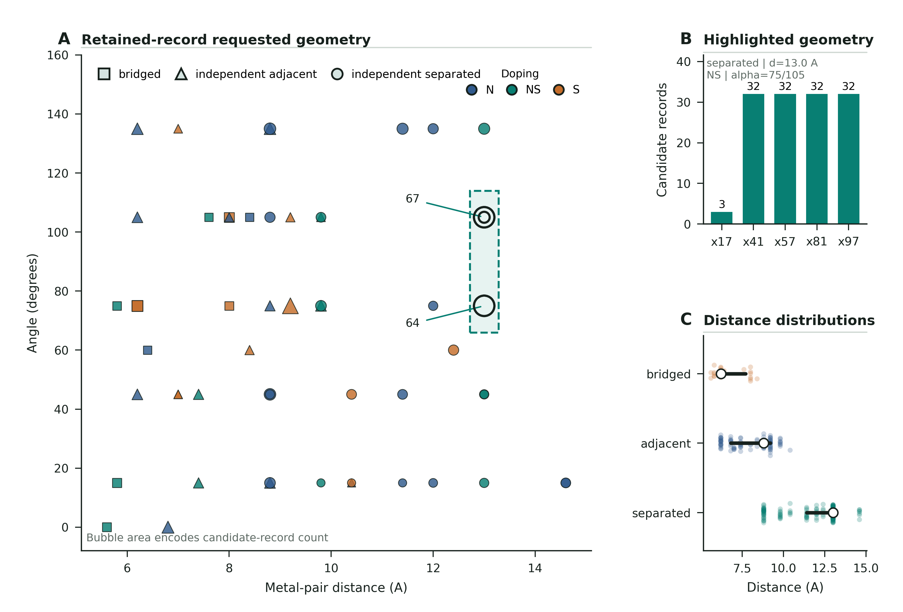
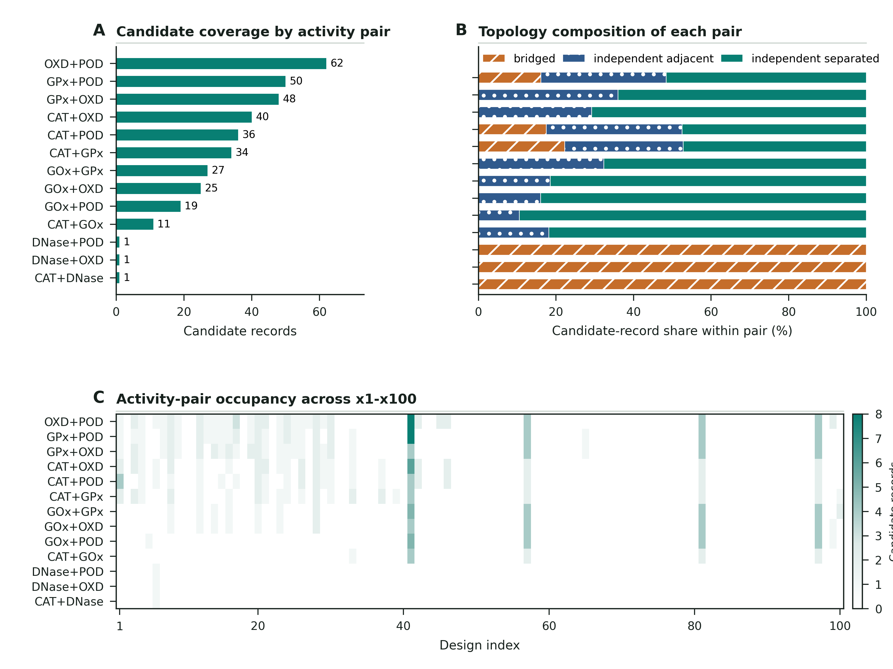
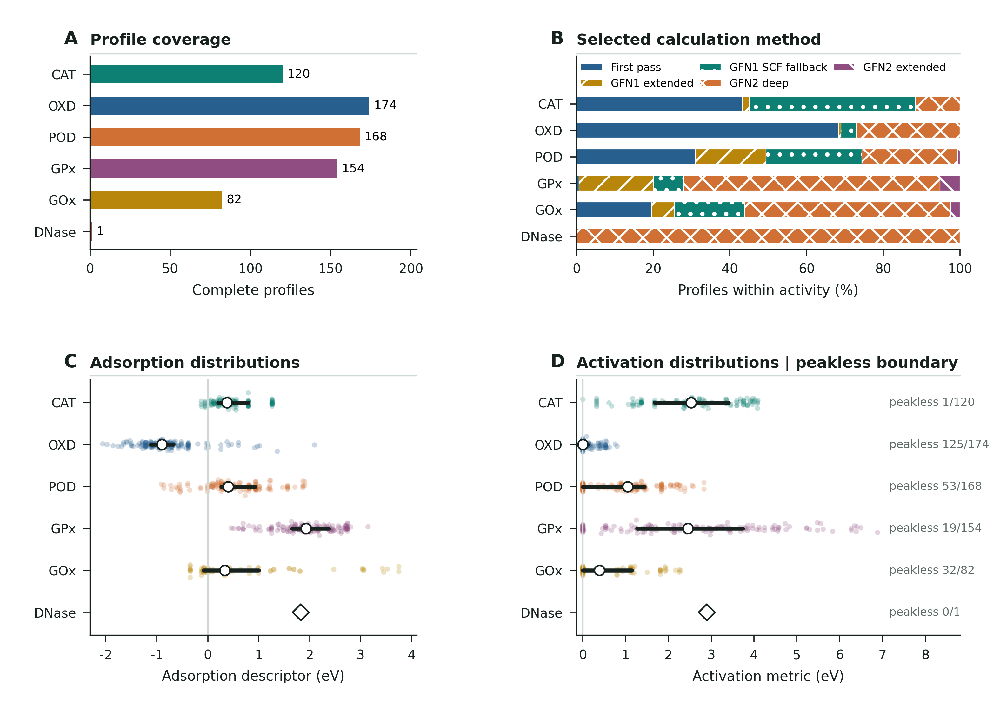
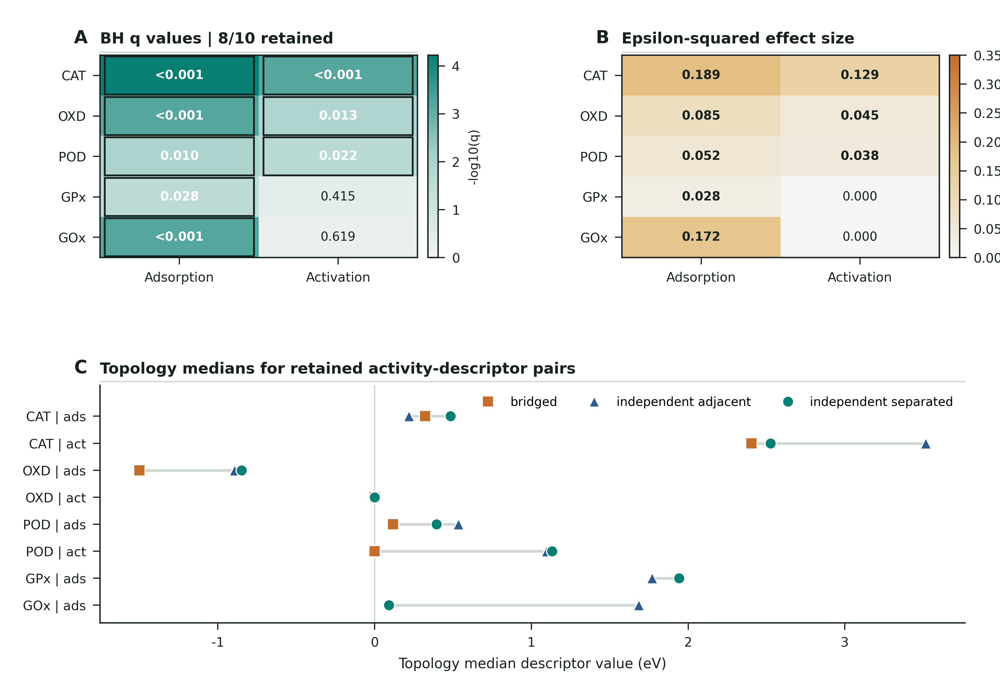

# E2N x1-x100 规范化数据与论文修改技术报告

## 技术摘要

本报告以 `publication/data/x1_x100_dataset` 为当前论文数据的唯一公开接口，并从候选体、活性 profile 和扫描帧三个统计单位重新核算全部核心数字。可复现结果为 **355 条保留的规范化候选体记录、699 条完整活性 profile、3515 个完整 profile 内的收敛扫描帧**；候选体覆盖 38 个 x1-x100 设计索引、13 种声明活性对和 3 种拓扑，profile 覆盖 6 种活性。

最重要的口径修正是：**355 不能在没有限定语时写成整个研究流程中统一定义的“可计算候选体数”**。其中 172 条旧源记录依据可用的正向完整-profile endpoint 保留，183 条新源记录具有显式 `calculable=True`。因此，当前最稳妥的论文表述是 **“355 retained canonical candidate records（355 条保留的规范化候选体记录）”**。

候选体与 profile 的连接分布为 346/7/2：346 个候选体连接两个完整 profile，7 个连接一个，2 个没有保留的完整 profile。该分布只描述保留候选体集内部的 profile linkage，**不能转换为 97.5% 的研究流程成功率、双活性率、实验活性率或统一可计算率**。

当前数据足以支持一篇关于“蛋白质证据到纳米材料假设的可审计转译与筛选数据组织”的论文，但不足以支持催化优越性、实验双活性、无能垒反应、无约束结构稳定性、拓扑因果效应或预测准确率。公开表还缺少完整的候选体金属身份、氧化态和源位点 lineage；这应在投稿前补充，或在数据可用性声明中明确列为公开快照限制。

## 1. 权威边界与统计单位

本报告回答两个问题：第一，GitHub 发布层中究竟有哪些可公开、可重复核算的数据；第二，论文中每个主要数字可以写到什么程度。报告生成时间以源数据 manifest 为准：`2026-07-10T17:04:24.870599+00:00`。

| 统计单位 | 规范化数量 | 定义 | 不能替代的概念 |
| --- | ---: | --- | --- |
| 候选体记录 | 355 | `candidate_id` 唯一的保留记录 | 全部尝试、产率、成功率、独立材料组成数 |
| 活性 profile | 699 | 对某一候选体和某一活性的完整轨迹记录 | 候选体数、实验活性数、独立样本数 |
| 扫描帧 | 3515 | 完整 profile 中 `converged_frames` 的聚合和 | 唯一 frame ID 数；公开表没有逐帧主键 |
| 设计索引 | 38/100 | 至少出现一条保留候选体的 x1-x100 位置 | 62 个空位置的失败数或未尝试数 |
| 活性对 | 13 | 候选体在计算前声明的两个目标活性 | 同一材料已经证明的双活性 |
| 拓扑 | 3 | bridged、independent adjacent、independent separated | 因果材料机制或稳定性类别 |

### 1.1 两个候选体源块采用不同的保留依据

数据 manifest 记录了两个候选体输入块（172 行和 674 行）以及两个 profile 输入块（344 行和 362 行）。重新追溯 builder 规则后，候选体保留过程应表述为：

- 旧源候选体块：原表 172 行，没有统一 `calculable` 字段；这 172 行已经是具有至少一个完整 profile endpoint 的正向保留记录。
- 新源候选体块：原表 674 行，其中 183 行满足显式 `calculable=True`，进入规范化候选体表。
- 旧源 profile 块：344 行中 339 行完整，保留 1715 个完整 profile 帧；5 行不完整记录被排除。
- 新源 profile 块：362 行中 360 行完整，保留 1800 个完整 profile 帧；2 行不完整记录被排除。
- 规范化 profile 合计为 339 + 360 = 699，规范化帧合计为 1715 + 1800 = 3515。

历史 lineage 审计中的 706 条 eligible profile 和 3580/3590 帧把 7 条不完整 profile 及其部分收敛帧也纳入了上游流程计数。它们适合内部流程审计，但不适合当前成功集论文正文。

## 2. 候选体集：拓扑、设计网格与活性对

### 2.1 三种拓扑以 independent separated 为主，但这是保留集组成

| 拓扑 | 候选体数 | 占比 (%) | 覆盖设计索引 | 距离 Q1 (A) | 距离中位数 (A) | 距离 Q3 (A) |
| --- | --- | --- | --- | --- | --- | --- |
| bridged | 28 | 7.9 | 10 | 6.1 | 6.2 | 7.7 |
| independent adjacent | 101 | 28.5 | 19 | 6.8 | 8.8 | 9.2 |
| independent separated | 226 | 63.7 | 28 | 11.4 | 13.0 | 13.0 |

independent separated 占 226/355（63.7%），independent adjacent 占 101/355（28.5%），bridged 占 28/355（7.9%）。这一比例同时受到枚举队列、设计家族重复、金属组合、构建规则和计算保留条件影响，不能解释为拓扑本身的成功概率。

请求距离的中位数按拓扑依次约为 6.2 A、8.8 A 和 13.0 A。距离和角度来自请求设计字段，并非去除约束后的平衡几何；图 2 的正确语义是“保留记录对请求设计网格的占据”。

### 2.2 设计占据高度集中，但不能称为优化或富集

100 个设计索引中只有 38 个出现保留记录。候选体数最高的索引如下：

| 设计索引 | 候选体数 | profile 数 | 拓扑数 | 活性对数 | 掺杂 | 角度 (deg) |
| --- | --- | --- | --- | --- | --- | --- |
| x41 | 52 | 98 | 2 | 10 | NS;S | 75 |
| x57 | 32 | 64 | 1 | 10 | NS | 105 |
| x81 | 32 | 64 | 1 | 10 | NS | 75 |
| x97 | 32 | 64 | 1 | 10 | NS | 105 |
| x28 | 16 | 32 | 2 | 8 | N | 135 |
| x20 | 14 | 28 | 2 | 8 | N | 45 |
| x8 | 13 | 26 | 2 | 8 | N | 135 |
| x1 | 11 | 22 | 2 | 6 | N;NS | 0 |
| x12 | 11 | 22 | 2 | 8 | N | 105 |
| x3 | 9 | 18 | 3 | 5 | N;S | 60 |
| x30 | 9 | 17 | 2 | 6 | NS;S | 45 |
| x16 | 8 | 16 | 2 | 7 | N | 75 |

把设计索引折叠后，355 条记录占据 49 个不同的“拓扑-距离-掺杂-角度”设置；保留 `design_index` 时有 57 个设计-拓扑-几何单元。最密集的两个设置是 independent separated、13.0 A、NS、105 deg（67 条）和同条件 75 deg（64 条）。其中 75 deg 由 x41 和 x81 各 32 条组成；105 deg 由 x17 的 3 条、x57 的 32 条和 x97 的 32 条组成。

这些计数证明的是“该研究流程重复实例化并保留了这些设置”，而不是：13.0 A 是最优距离、NS 是最佳掺杂、75/105 deg 是涌现平衡角、这些设置具有更高成功概率，或两个金属中心已证明协同。

### 2.3 13 种声明活性对的覆盖不均衡

| 声明活性对 | 候选体数 | 占比 (%) | 覆盖设计索引 | 拓扑数 |
| --- | --- | --- | --- | --- |
| Oxidase + Peroxidase | 62 | 17.46 | 32 | 3 |
| Glutathione Peroxidase + Peroxidase | 50 | 14.08 | 27 | 2 |
| Glutathione Peroxidase + Oxidase | 48 | 13.52 | 27 | 2 |
| Catalase + Oxidase | 40 | 11.27 | 23 | 3 |
| Catalase + Peroxidase | 36 | 10.14 | 22 | 3 |
| Catalase + Glutathione Peroxidase | 34 | 9.58 | 21 | 2 |
| Glucose Oxidase + Glutathione Peroxidase | 27 | 7.61 | 12 | 2 |
| Glucose Oxidase + Oxidase | 25 | 7.04 | 12 | 2 |
| Glucose Oxidase + Peroxidase | 19 | 5.35 | 6 | 2 |
| Catalase + Glucose Oxidase | 11 | 3.10 | 5 | 2 |
| Catalase + DNase | 1 | 0.28 | 1 | 1 |
| DNase + Oxidase | 1 | 0.28 | 1 | 1 |
| DNase + Peroxidase | 1 | 0.28 | 1 | 1 |

Oxidase + Peroxidase 数量最多（62），随后是 Glutathione Peroxidase + Peroxidase（50）和 Glutathione Peroxidase + Oxidase（48）。三个含 DNase 的活性对各只有一个候选体，均不能支持分布性推断。若干含 Glucose Oxidase 的活性对以 independent separated 为主，例如 Glucose Oxidase + Peroxidase 中 17/19 为该拓扑；这仍然是成功条件化设计分配，而非比较活性证据。

## 3. 候选体与完整 profile 的连接关系

| 每个候选体的完整 profile 数 | 候选体数 | 占保留候选体 (%) |
| --- | --- | --- |
| 0 | 2 | 0.56 |
| 1 | 7 | 1.97 |
| 2 | 346 | 97.46 |

完整连接分布严格为 346/7/2。没有完整 profile 的候选体 ID 为 `16e7f330, b5aad8dd`；只有一个完整 profile 的候选体 ID 为 `644a5e9e, 9034c955, 77b47a61, 9b19eaa6, b876b6fa, e079d280, 74c8179e`。这些 ID 被保留是因为候选体表和 profile 表使用不同的成功边界。

帧数分布为：698 条 profile x 5 帧, 1 条 profile x 25 帧。因此 3515 是聚合帧数，不是公开可逐帧追踪的唯一记录数。

论文中可以写：“在保留的规范化候选体记录中，346 个候选体与两个完整活性特异性 profile 相连，7 个与一个相连，2 个没有保留的完整 profile。”随后必须补充：“该分布不构成研究流程完成率或双活性验证率。”

每条候选体记录声明两个目标活性，因此 355 条记录一共对应 710 个声明目标槽位。按活性与 699 条完整 profile 对账如下：

| 活性 | 声明目标槽位 | 完整 profile | 缺少完整 profile 的槽位 |
| --- | --- | --- | --- |
| Catalase | 122 | 120 | 2 |
| DNase | 3 | 1 | 2 |
| Glucose Oxidase | 82 | 82 | 0 |
| Glutathione Peroxidase | 159 | 154 | 5 |
| Oxidase | 176 | 174 | 2 |
| Peroxidase | 168 | 168 | 0 |

合计有 710 个声明目标槽位、699 条完整 profile 和 11 个未连接到完整 profile 的槽位。11 个缺口由两部分组成：7 条被完整性规则排除的不完整 profile，以及两个零完整-profile 候选体所对应的另外 4 个声明目标槽位。这里的“缺口”是公开规范化表之间的连接差额，不等同于反应失败、无活性或候选体不可计算。

## 4. Profile 组成、描述符与计算路径

### 4.1 六种活性的 profile 数量和无正峰边界

| 活性 | profile 数 | 吸附中位数 (eV) | 正向峰值中位数 (eV) | 无正峰数 | 无正峰占比 (%) | 计算路径数 | 有记录拓扑数 |
| --- | --- | --- | --- | --- | --- | --- | --- |
| Catalase | 120 | 0.3738 | 2.5299 | 1 | 0.83 | 4 | 3 |
| DNase | 1 | 1.8235 | 2.8917 | 0 | 0.00 | 1 | 1 |
| Glucose Oxidase | 82 | 0.3332 | 0.3834 | 32 | 39.02 | 5 | 2 |
| Glutathione Peroxidase | 154 | 1.9257 | 2.4574 | 19 | 12.34 | 5 | 2 |
| Oxidase | 174 | -0.8972 | 0.0000 | 125 | 71.84 | 4 | 3 |
| Peroxidase | 168 | 0.4035 | 1.0429 | 53 | 31.55 | 5 | 3 |

Oxidase 的无正峰比例最高：125/174（71.84%）；Glucose Oxidase 为 32/82（39.02%），Peroxidase 为 53/168（31.55%），Glutathione Peroxidase 为 19/154（12.34%），Catalase 为 1/120（0.83%）。DNase 只有一条记录，不做总体推断。

这里的零值严格表示：在存储的有限 forward scan 采样点中，没有观察到相对于首点的正向峰。因此应使用 `peakless profile` 或“无正峰描述符边界”，不得写成 zero kinetic barrier、barrier-free reaction、无活化能或无催化活性。

描述符之间还存在由定义和有限扫描轨迹造成的精确重合：218/699 条 profile 的 forward scan peak descriptor 与 reaction energy 数值相同，157/699 条与 scan energy range 数值相同。这些重合不是独立测量之间的验证，也不能作为物理机制相关性的证据；解释相关矩阵时必须保留这一计算依赖关系。

### 4.2 计算路径分布明显依赖活性

| 计算路径 | profile 数 | 占比 (%) |
| --- | --- | --- |
| First pass | 240 | 34.33 |
| GFN1 SCF fallback | 128 | 18.31 |
| GFN1 extended | 69 | 9.87 |
| GFN2 deep | 251 | 35.91 |
| GFN2 extended | 11 | 1.57 |

GFN2 deep 为 251/699，First pass 为 240/699，GFN1 SCF fallback 为 128/699，GFN1 extended 为 69/699，GFN2 extended 为 11/699。更关键的是，各活性内部的路径组成不同：Oxidase 中 First pass 占 119/174（68.4%），Glutathione Peroxidase 中 GFN2 deep 占 103/154（66.9%），Glucose Oxidase 中 GFN2 deep 占 44/82（53.7%）。

GFN1 和 GFN2 并非可互换能标，rescue 深度也可能与候选体化学和收敛难度相关。因此跨活性或跨拓扑的 pooled descriptor 图只能描述当前保留语料，不能作为统一协议下的严格能量比较。

### 4.3 Spearman 相关性属于混合语料的描述性结果

公开 `descriptor_correlation.csv` 是 699 条 profile 上的 Spearman 相关矩阵，已在本报告中以最大误差 4.63e-07 独立复算。绝对值较大的非对角关联包括：activation 与 reaction energy（rho=0.672879）、adsorption 与 scan range（rho=0.429351）、adsorption 与 activation（rho=0.395817）、activation 与 scan range（rho=0.327395）、distance 与 score（rho=0.318627），以及 reaction energy 与 scan range（rho=-0.306418）。

这些相关性混合了活性、方法、拓扑和设计家族，且同一候选体可贡献两个 profile；它们不能被当作独立样本下的机制关系或因果效应。

## 5. 拓扑检验：8/10 达到 q<0.05，但解释必须是探索性的

| 活性 | 描述符 | 拓扑样本数 | H | p | q | epsilon-squared | q<0.05 |
| --- | --- | --- | --- | --- | --- | --- | --- |
| Catalase | adsorption | bridged=16;independent adjacent=36;independent separated=68 | 24.056140 | 5.97e-06 | 5.974e-05 | 0.188514 | True |
| Glucose Oxidase | adsorption | bridged=0;independent adjacent=13;independent separated=69 | 14.750086 | 0.00012274 | 0.00061371 | 0.171876 | True |
| Catalase | activation | bridged=16;independent adjacent=36;independent separated=68 | 17.149174 | 0.00018884 | 0.00061566 | 0.129480 | True |
| Oxidase | adsorption | bridged=18;independent adjacent=50;independent separated=106 | 16.618226 | 0.00024626 | 0.00061566 | 0.085487 | True |
| Peroxidase | adsorption | bridged=19;independent adjacent=51;independent separated=98 | 10.660820 | 0.00484209 | 0.00968417 | 0.052490 | True |
| Oxidase | activation | bridged=18;independent adjacent=50;independent separated=106 | 9.707765 | 0.00779804 | 0.0129967 | 0.045075 | True |
| Peroxidase | activation | bridged=19;independent adjacent=51;independent separated=98 | 8.345303 | 0.0154113 | 0.0220162 | 0.038456 | True |
| Glutathione Peroxidase | adsorption | bridged=0;independent adjacent=48;independent separated=106 | 5.216276 | 0.0223764 | 0.0279705 | 0.027739 | True |
| Glutathione Peroxidase | activation | bridged=0;independent adjacent=48;independent separated=106 | 0.792476 | 0.373352 | 0.414836 | 0.000000 | False |
| Glucose Oxidase | activation | bridged=0;independent adjacent=13;independent separated=69 | 0.247437 | 0.618886 | 0.618886 | 0.000000 | False |

10 项检验的 SciPy Kruskal-Wallis 统计量、全局 Benjamini-Hochberg 校正和 epsilon-squared 均被独立复算，最大数值偏差小于 0.00e+00。8 项 q<0.05；未保留的是 Glutathione Peroxidase activation（q=0.414836）和 Glucose Oxidase activation（q=0.618886）。

效应量最大的三项是 Catalase adsorption（epsilon-squared=0.1885）、Glucose Oxidase adsorption（0.1719）和 Catalase forward scan peak（0.1295）。最小的保留项是 Glutathione Peroxidase adsorption（0.0277）。q 值和效应量回答不同问题，不能用显著性替代实际差异大小。

需要特别说明：Glucose Oxidase 和 Glutathione Peroxidase 没有 bridged profile，因此相应行实际上是两个非空拓扑组的比较。原始 `group_sizes` 字段仍以固定三拓扑顺序保存为 `0;13;69` 或 `0;48;106`，不能直接与只列两个名称的 `compared_topologies` 逐项 zip。本报告的 `topology_tests_recomputed.csv` 已增加带键样本数。

这些检验受成功条件约束，且拓扑与请求距离、角度、掺杂、金属身份、活性对、设计家族和计算路径混杂。正确表述是“当前规范化 profile 语料中的探索性拓扑分层”，不得写成拓扑导致更高活性、某拓扑普遍更优或材料设计规律。

## 6. 代表性 x57 记录的正确用途

代表性候选体为 `31967c28`，设计索引 `x57`，声明活性对为 `Glucose Oxidase + Peroxidase`，拓扑为 `independent separated`，请求距离 13.0 A，NS 掺杂，请求角度 105 deg，score=0.767626，最大力=0.042680 eV/A。

- Glucose Oxidase 轨迹：0.0000, 0.7830, 1.8096, -2.1049, -1.2747 eV。
- Peroxidase 轨迹：0.0000, -0.3307, -0.1449, -0.4431, -1.3777 eV。

这条记录可以展示一个候选体如何连接两个各自独立、带方法来源的 activity-specific profile。它不是最高排名候选体，也不能证明两个反应在同一条件下发生，更不能证明实验双活性或 cascade catalysis。

代表性记录的实际选择规则也需要透明：构建器先把 536 张私有结构图与规范化候选体求交，再要求候选体至少连接两个完整 profile，共得到 179 条 eligible 记录；随后选择最接近 eligible 集合 score 中位数的记录，并以 `design_index` 和 `candidate_id` 进行确定性并列排序。选择逻辑没有显式筛选 x57 或 13.0 A/NS/105 deg 窗口，因此它应称为“具有可用结构图和两个完整 profile 的中位 score 示例”，而不是针对高密度几何窗口挑选的代表。

公开的 `representative_scans.csv` 是从私有原始结果 JSON 抽取并冻结的 10 行扫描快照，不能只凭 `profiles.csv` 重新生成。它支持图 1 的轨迹复现，但不代表发布包包含逐帧上游轨迹或完整 campaign 重建材料。

## 7. 数据质量、可追溯性与公开发布限制

### 7.1 已通过的完整性检查

- 355 个 `candidate_id` 和 699 个 `profile_id` 均唯一。
- profile 外键全部指向候选体，设计、拓扑、距离、掺杂和角度连接后无不一致。
- 所有 profile 的帧数为正，且 `frame_count == converged_frames`。
- 设计轴完整保留 x1-x100，候选体实际出现于 38 个索引。
- 13 种活性对、6 种活性和 3 种拓扑均与 manifest 一致。
- 17 个 panel 源数据 CSV 齐全，五张图的 PNG/SVG/PDF 均存在，图 QA 为 5/5。
- 拓扑检验和 Spearman 相关矩阵均可从公开表独立复算。

### 7.2 公开候选体表仍缺少关键化学来源字段

在公开 `candidates.csv` 中，355 个 ID 唯一，但按可见科学字段（活性对、拓扑、距离、掺杂、角度、variant）只有 240 个不同组合，115 条额外记录依赖不透明的 `candidate_id` 才能区分。新源块内部实际还存在金属 A/B、氧化态和 metal-case 字段，但规范化表没有公开；旧源块本身也不含同等完整的金属 lineage。

因此，当前发布包可以复算论文图表和统计，但无法仅凭公开列解释 355 条记录之间全部化学差异，也不能从原始 campaign 重新构建规范化快照。投稿前有两个可接受方案：

1. 增加可再分发的候选体 provenance 表，至少包含 `candidate_id`、metal A/B、氧化态、源设计家族和来源类型；旧源缺失项明确标为 unavailable。
2. 如果不能公开，需在 Data Availability 中明确：公开包是经审计的分析快照，可复算表格/图/统计，但不包含完整上游原始结构、私有路径和所有候选体级生物/化学 lineage。

### 7.3 当前可分享置信度

对“复算当前论文五图和规范化描述统计”而言，数据在**科学与技术审计层面已就绪**。这不等于已获得公开再分发授权：作者、版权主体、年份及代码/数据/图许可范围冻结前，整个发布包在法律与归档层面仍为 **Not ready for public release**。对“从原始 PDB/候选体构建全过程端到端复现”或“证明候选体完整化学 provenance”而言，即使许可问题解决，当前发布仍为 **Share with caveats**，因为上游原始块、逐帧数据、完整金属字段和候选体级 PDB lineage 未包含在公开层。

详细逐项检查见 `reports/tables/data_quality_checks.csv`。

## 8. 历史数据版本的冲突与使用规则

| version_or_scope | candidate_unit | profile_unit | frame_unit | statistics | use_in_current_manuscript |
| --- | --- | --- | --- | --- | --- |
| paper_data_current (2026-06-25) | 22 calculable candidates | 44 complete profiles | 280 converged frames | 8 tests; 0 FDR-retained | No - superseded historical snapshot |
| broader x1-x100 lineage audit | 1817 upstream records; 661 MACE; historical 355 calculable label | 699 complete / 706 eligible | 3580 converged / 3590 attempted | batch-level lineage | No - audit lineage only; legacy values prohibited |
| v5 audited submission | 355 retained canonical candidate records | 699 complete profiles | 3515 frames in complete profiles | 10 tests; 8 q<0.05; 36 DOI references; 5 review rounds | Yes - numerical and figure authority |
| v6 narrative manuscript | 355 stated as calculable (wording too broad) | 699 complete profiles | 3515 converged frames | 30 references; 3 v6 review rounds; 7133 main-text words | Narrative input only; requires evidence corrections |
| current evidence contract / public release | 355 retained canonical candidate records | 699 complete profiles; linkage 346/7/2 | 3515 aggregate converged frames | 10 exploratory tests; 8 q<0.05 | Recommended controlling terminology |

`paper_data_current` 是早期 2026-06-25 快照，包含 18 个 EC 类、1245 个 PDB 文件、720 个 motif、2959 条金属位点和 2573 条配体/辅因子记录；其后半部分筛选只有 22 个候选体、44 个完整 profile 和 280 个帧。它可用于说明早期项目谱系，不能替代当前 x1-x100 canonical 数据。

broader lineage 中的 1817、661、706、699/706、3580/3590 是上游流程与不完整记录审计值。它们与当前 355/699/3515 的统计边界不同，不能混在同一正文叙述中。当前论文的数值和图形权威应以 audited canonical tables、五图源数据和 current evidence contract 为准；v6 只作为叙事和术语优化输入。

## 9. 对 v6 正文的逐项修改建议

### 9.1 全文统一改写的核心数字句

将无条件的 “355 calculable candidates” 改为：

> The canonical release contains 355 retained candidate records, 699 complete activity-specific profiles, and 3515 converged scan frames. The two candidate source blocks used different available retention fields; these counts therefore describe a success-conditioned analysis set rather than a campaign-wide calculability rate.

中文含义：规范化发布层包含 355 条保留候选体记录、699 条完整的活性特异性 profile 和 3515 个收敛扫描帧。两个候选体源块采用不同的可用保留字段，因此这些数字描述的是成功条件化分析集，而非研究流程统一可计算率。

### 9.2 删除无约束 MACE 五候选体段落

删除 v6 Discussion/Evidence boundaries 中关于“5 个无约束 MACE 候选体、0 个保持拓扑、4 个达到力收敛”的整段结果。它来自更早的 22 候选体快照，不属于当前 x1-x100 retained canonical snapshot，也不是系统抽样验证集。保留它会重新引入用户已明确要求排除的失败结果，并混淆版本边界。

### 9.3 346/7/2 只能作为 linkage

可以在数据完整性或方法部分报告 346/7/2，但不得计算或突出 346/355=97.5% 作为双活性完成率。完整 profile 是计算轨迹完整性，不是催化活性判定。

### 9.4 压缩 Results 中重复计数

方法路径的逐活性 24 个单元格计数、13 个活性对的全部计数以及 10 组 H/p/q 不必全部写入正文。建议正文保留：总数、最主要的 2-3 个模式和解释边界；完整数字放入表格、图源数据或补充材料。这样可保留 v6 的科学定位，同时接近 v5 的篇幅和可读性。

### 9.5 图 2 的术语必须保持“requested”

所有 distance、angle、geometry 均写成 requested design distance/angle/geometry。13.0 A、NS、75/105 deg 只能称为 densely represented retained-grid cells 或 hypothesis class，不能称 optimum、enrichment、superior geometry、higher success probability 或 equilibrium structure。

### 9.6 图 4 的零值和方法来源

activation metric 统一改为 forward scan peak descriptor。零值写成 peakless descriptor boundary。正文需保留 GFN1/GFN2 路径混合的限制，避免把 pooled descriptor 解释为统一能标。

### 9.7 图 5 的统计语气

使用 observational、exploratory、success-conditioned、confounded、profile-level omnibus association。避免 causal effect、topology-controlled performance、universally superior topology。q 与 epsilon-squared 分开报告。

### 9.8 当前正文不得使用的历史数字

正文、摘要、图注和结论中不要使用：`1817`、`661`、`706`、`699/706`、`3580/3590`。这些数字可以只在内部 provenance 报告中出现，并明确标为历史上游审计口径。

## 10. GitHub 发布包的建议边界

公开仓库应支持两种不同层次的复现：

1. **release-level reproduction**：从 `publication/data/x1_x100_dataset` 验证 355/699/3515、重新生成派生表、复算拓扑检验、重绘五张图并核对图源数据。这一层应在 GitHub clone 后直接可运行。
2. **full upstream rebuild**：从 PDB 库、motif 数据库、原始候选体结构、MACE/xTB 轨迹和 rescue 输出重新生成 canonical snapshot。当前大体量本地 `outputs/`、数据库、模型权重和结构库不在发布层中，因此不能宣称公开仓库已实现这一层。

建议公开：核心代码、当前构建/作图/审计脚本、精简复现环境、canonical 表、五图及 17 个 panel 源数据、报告、证据合同和 release manifest。不要公开：本机路径、缓存、模型权重、期刊网页镜像、未授权第三方资产、整个历史 `outputs/`、失败/中间批次和根目录重复导出文件。

## 11. 推荐下一步

1. 用本报告控制 v6/v7 的数字和术语，先修正文再做最终 DOCX/PDF QA。
2. 决定是否能公开候选体金属/氧化态/provenance；若不能，强化 Data Availability 的快照边界。
3. 将 24 个方法-活性计数、13 个活性对计数和 10 项拓扑检验移至补充表或数据报告，正文只保留主要模式。
4. 冻结作者、单位、通讯作者、基金、非作者致谢、仓库 URL、归档 DOI 和数据/图许可范围。
5. 发布前运行 `python scripts/build_spj_data_summary_report.py`、`python publication/scripts/verify_publication_release.py`，再从 canonical data 重新生成五图并核对 release manifest。

## 12. 仍需作者决定的问题

- 355 条候选体是否要在公开 archive 中补充金属 A/B、氧化态和源位点/设计家族字段？
- MIT 是否只覆盖软件，数据和图是否另用 CC BY 4.0 或其他许可？
- GitHub 是否使用现有远端，还是建立一个历史干净的论文发布仓库？
- repository DOI 由 Zenodo/GitHub release 还是机构仓储生成？
- 正文是否继续在 v6 文件上逐段合并，同时以 current evidence contract 控制全部数字和术语？

## 附录：本报告生成的派生表

- `candidate_profile_linkage.csv`：355 条候选体与完整 profile 的连接明细。
- `profile_linkage_summary.csv`：346/7/2 分布。
- `declared_target_profile_reconciliation.csv`：710 个声明目标槽位与 699 条完整 profile 的逐活性对账。
- `candidate_topology_summary.csv`、`candidate_doping_summary.csv`、`candidate_angle_summary.csv`。
- `activity_pair_counts.csv`、`activity_pair_topology_summary.csv`。
- `design_occupancy.csv`、`geometry_cell_summary.csv`。
- `profile_activity_summary.csv`、`method_activity_summary.csv`、`method_total_summary.csv`。
- `topology_tests_recomputed.csv`：带键样本数及独立复算结果。
- `data_quality_checks.csv`：完整性、外键、统计复算和公开边界检查。
- `version_reconciliation.csv`：历史版本口径对照。

本报告是技术审计和论文修改依据，不是实验催化性能声明。
